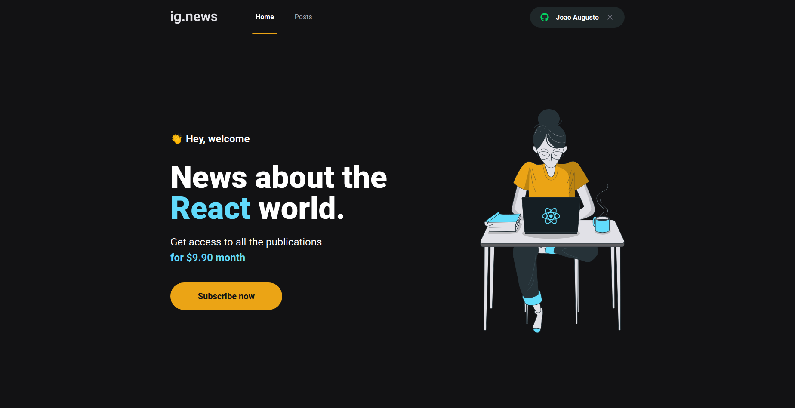

<div align=center>

<h3>

Projeto (em desenvolvimento) do Programa Ignite - Trilha ReactJS - da [Rocketseat], com **NextJS**, **Typescript** e **Sass**.

</h3>



</div>

## 📚 **Sobre**

O ignews é um blog de assinatura, que apresenta uma prévia do conteúdo de forma pública, enquanto que a íntegra é reservada somente aos seus assinantes. 
<br>

### 📌  **Tecnologias utilizadas**
- Next.JS
- Sass
- Stripe 
- FaunaDB 
- PrismicCMS 
- OAuth 
- Axios

<br>

### 🚀 **Mão na massa**

```bash
# Clone este repositório
$ git clone https://github.com/Joao-Augusto-Oliveira/ignews

# Acesse a pasta do projeto no terminal/cmd
$ cd ignews

# Instale as dependências
$ yarn

# Execute a aplicação em modo de desenvolvimento
$ yarn dev


```

<br>
<br>

<h3 align="center">
Feito com 💜 por <a href="https://www.linkedin.com/in/joão-augusto-oliveira-dos-santos-9b0693195">João Augusto</a>
<br><br>
 
  
</a>
</h3>

<!-- Links -->

[Rocketseat]: https://rocketseat.com.br/


